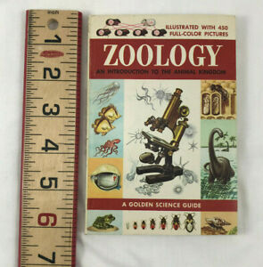

# Python และ R ในการวิเคราะห์ข้อมูลวิชา ecology laboratory


**ที่มาเเละเป้าหมาย:** ไอเดียการเขียนหนังสือเล่มนี้ขึ้นมาเกิดขึ้นเมื่อผู้เขียนได้มีโอกาสคุมเเลปวิชานิเวศวิทยาเเละสังเกตว่า นิสิตนักศึกษาบางคนพยายามใช้ python เพื่อวิเคราะห์ผลการศึกษา เเต่หลาย ๆ ส่วนยังเขียนไม่สมบูรณ์ ผู้เขียนจึงพยายามรวบรวมเเละเขียนให้อยู่ในรูปเเบบที่ง่าย ให้ผู้เรียนใช้เป็นเเนวทางการวิเคราะห์ข้อมูลด้านนิเวศวิทยากับ **ภาษาคอมพิวเตอร์**\*ี่เป็นที่นิยมในงานวิเคราะห์ทางสถิติ เช่น R, Python เพื่อให้เกิดความประทับใจ เเละคุ้นชินเพื่อเตรียมพร้อมหากในอนาคตผู้เรียนต้องการศึกษาด้านนิเวศวืทยาในเชิงลึก ดพราะข้อมูลประ้ภทนี้หลายครังมีขนาดใหญ่เเละมีความจำเพาะบางอย่างอยู่ ดังนั้นเพื่อเป็นเเนวทาง เเละเเบบฝึกหัดสำหรับผู้ทที่เริ่มต้นเรียนการวิเคราะห์ข้อมูลด้วยภาษาคอมพิวเตอร์เหล่านี้ได้ลองใช้กับข้อมูลนิเวศวิทยาที่ยังไม่ซับซ้อนมากในวิชานิเวศวิทยา ซึ่งเนื้อหาในเล่มนี้จะไม่ครอบคลุมทุกส่วนของวิชา eco lab เเต่เป็นเน้นเพียงส่วนของการวิเคราะห์ผล ซึ่งใช้  _computer_  เป็นส่วนใหญ่ ไม่ครอบคลุมด้านเทคนิคการเก็บตัวอย่างหรือการ identify species ของสิ่งมีชีวิต


> Loom is a video messaging tool that helps you get your message across through instantly shareable videos.
>
> With Loom, you can record your camera, microphone, and desktop simultaneously. Your video is then instantly available to share through Loom's patented technology.
>
> — From the [Loom Docs](https://support.loom.com/hc/en-us/articles/360002158057-What-is-Loom-)

> The Mailchimp Marketing API provides programmatic access to Mailchimp data and functionality, allowing developers to build custom features to do things like sync email activity and campaign analytics with their database, manage audiences and campaigns, and more.
>
> — From the [Mailchimp Marketing API docs](https://mailchimp.com/developer/marketing/docs/fundamentals/)

## Getting Started

**Got 2 minutes?** Check out a video overview of our product:




**Good to know:** A succinct video overview is a great way to introduce folks to your product. Embed a Loom, Vimeo or YouTube video and you're good to go! We love this video from the fine folks at [Loom](https://loom.com) as a perfect example of a succinct feature overview.


### Guides: Jump right in

Follow our handy guides to get started on the basics as quickly as possible:


[simple\_stat](simple\_stat/)



[population.md](population.md)



[community.md](community.md)



**Good to know:** your product docs aren't just a reference of all your features! use them to encourage folks to perform certain actions and discover the value in your product.


### Fundamentals: Dive a little deeper

Learn the fundamentals of MyProduct to get a deeper understanding of our main features:


[Broken link](broken-reference)



[Broken link](broken-reference)



[Broken link](broken-reference)



[Broken link](broken-reference)



**Good to know:** Splitting your product into fundamental concepts, objects, or areas can be a great way to let readers deep dive into the concepts that matter most to them. Combine guides with this approach to 'fundamentals' and you're well on your way to great documentation!

